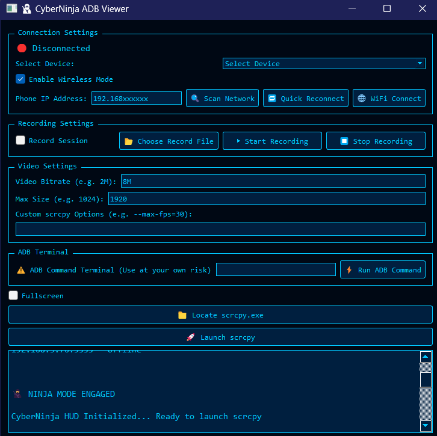

# 🥷 CyberNinjaADB

**A Python GUI tool for fast and wireless Android screen mirroring using scrcpy and ADB. Cyberpunk theme, supports USB and WiFi.**

---

## 🚀 Features

- USB & Wireless ADB connection
- Quick Reconnect & WiFi Connect buttons
- Scan Network to auto-find devices on your LAN
- scrcpy integration for mirroring & recording
- Run custom ADB commands (with safety checks)
- Cyberpunk neon-blue styled interface

---

## 🛠️ Requirements

- Python 3.x
- PyQt5
- scrcpy (download the Windows binary)
- Android device with USB debugging enabled

---

## 🏁 Quick Start

1. **Clone this repo:**
git clone https://github.com/kobepower/CyberNinjaADB.git

markdown
Copy code
2. **Install requirements:**
pip install PyQt5

markdown
Copy code
3. **Put `scrcpy.exe` in the project folder** (or use the GUI button to locate it).
4. **Run the app:**
python cyberninja_adb_viewer.py

yaml
Copy code

---

## 📸 Screenshots

---

## 📦 License

MIT License

---

## 🤖 Credits

Built by Kobe + ChatGPT  
2025
